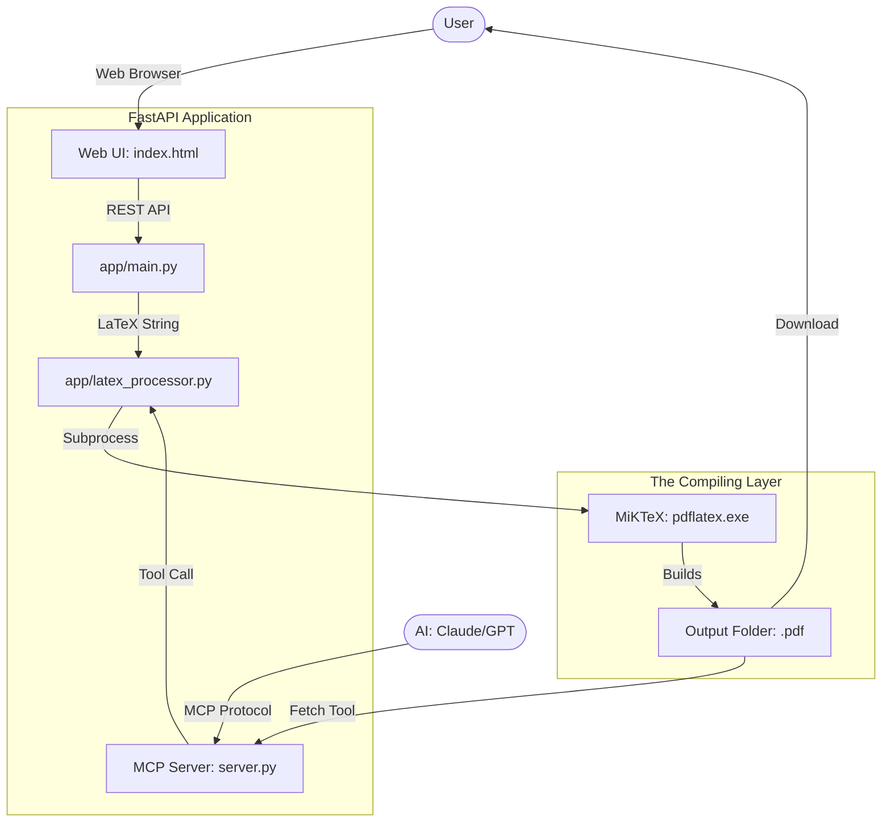

# 📄 LaTeX Resume Ecosystem: Comprehensive Guide

## 🏗 System Architecture

This application is a **Dual-Layered System** designed for human-AI collaboration.



---

## 🚀 Deployment Guide

### Phase 1: Environment Preparation (The "Must-Haves")

1.  **Python 3.10+**: The core logic engine.
2.  **MiKTeX (LaTeX)**: The "Printer". Without this, the code is just text.
    *   *Path Tip*: My code automatically searches `C:\Users\<User>\AppData\Local\Programs\MiKTeX\` and `C:\Program Files\MiKTeX\`.
3.  **Virtual Env**: Keeps your system clean.
    *   Setup: `python -m venv venv`
    *   Activate: `.\venv\Scripts\activate`

### Phase 2: Starting the Services

#### **A. The Web Application (For You)**
Run this to use the beautiful dark-themed UI.
```bash
python -m uvicorn app.main:app --reload --host 127.0.0.1 --port 8000
```

#### **B. The MCP Server (For your AI)**
Run this if you want your AI to be able to "type and print" resumes for you.
```bash
python mcp_server/server.py
```

---

## 🤖 How the AI Uses the MCP Tools

When you add this to **Claude Desktop**, you are giving the AI "Hands". Here is how it responds to common requests:

| User Request | What the AI does behind the scenes |
| :--- | :--- |
| "Create a resume for me" | AI writes LaTeX → calls `generate_resume_pdf` tool. |
| "What projects have I generated?" | AI calls `list_generated_pdfs` tool. |
| "I want to delete my old resume" | AI calls `delete_pdf` with the filename. |
| "Change my name in the PDF" | AI fetches the old LaTeX (if in context) → Edits → Calls `generate_resume_pdf` again. |

---

## 📂 Project Module Breakdown

### `app/latex_processor.py` (The Heavy Lifter)
*   **Safety**: Validates that the LaTeX has a `\begin{document}` before even trying to compile.
*   **Temporary Work**: Creates a hidden folder in `/temp` to run the build. LaTeX generates many "garbage" files (`.aux`, `.log`)—this module deletes them for you, leaving only the clean PDF.
*   **Dual-Pass**: It runs `pdflatex` twice. This is essential for LaTeX to calculate exact page numbers and clickable links.

### `mcp_server/server.py` (The AI Gateway)
*   **Schema Defined**: It tells the AI exactly what inputs are needed (e.g., "latex_code" is a string).
*   **Stdio Communication**: It talks to the AI via "Standard IO"—the same way terminals talk. This makes it incredibly fast and secure.

### `static/js/app.js` (The Nervous System)
*   **Code Editor**: Uses **CodeMirror** to give you line numbers and syntax colors.
*   **Async Operations**: When you click "Generate", it doesn't freeze the page. It waits for the backend and then "triggers" a browser download for you automatically.

---

## 🛠 Troubleshooting the Flow

*   **"PDF is empty or 0kb"**: This means the LaTeX had an error. Check the `output/*.log` file.
*   **"AI says 'Tool failed'"**: Ensure the MCP server is running and your Python path in the Claude config is absolute (use full paths like `D:/anup data/...`).
*   **"Port 8000 in use"**: You are probably running the server in another terminal. Close it or change the port in `app/config.py`.

---

## 📈 Scaling Up

This application is built using **FastAPI**, which means it is ready for high-performance usage.
*   To host this on a server, you would use **Docker**.
*   The `LaTeXProcessor` is separate from the API, so you could easily add a **Celery Worker** if you wanted to generate 1,000 resumes at once!

---

**Author**: Anup Ojha
**Stack**: Python, MiKTeX, FastAPI, MCP
**License**: Open-Source Developer Edition
